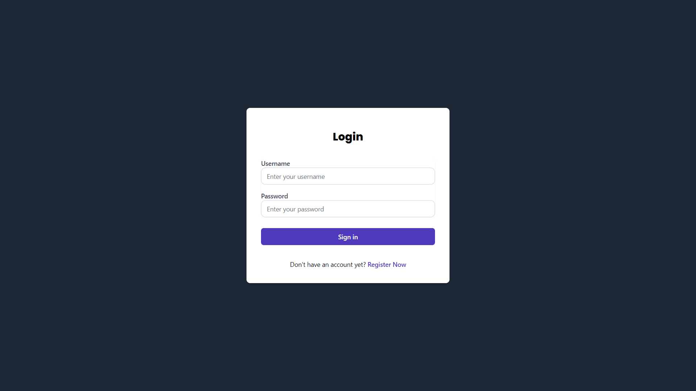
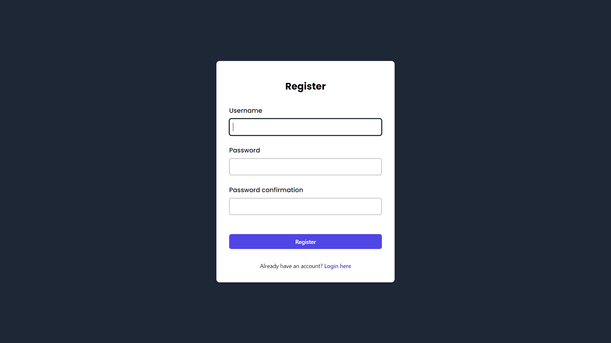
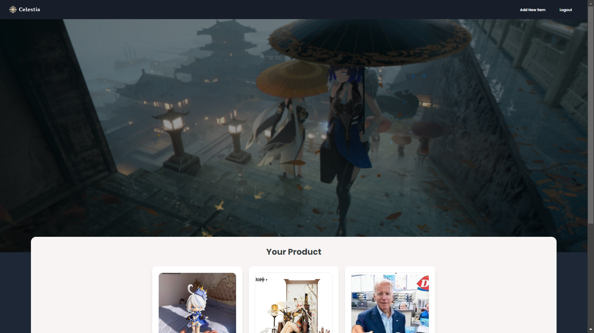
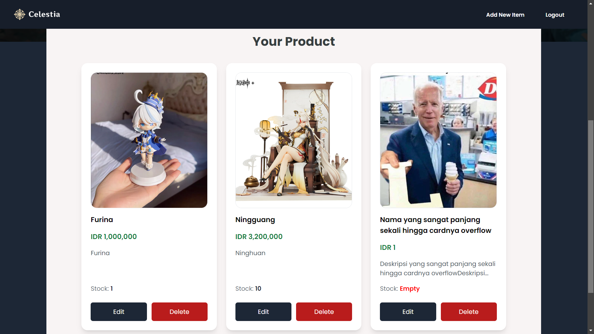
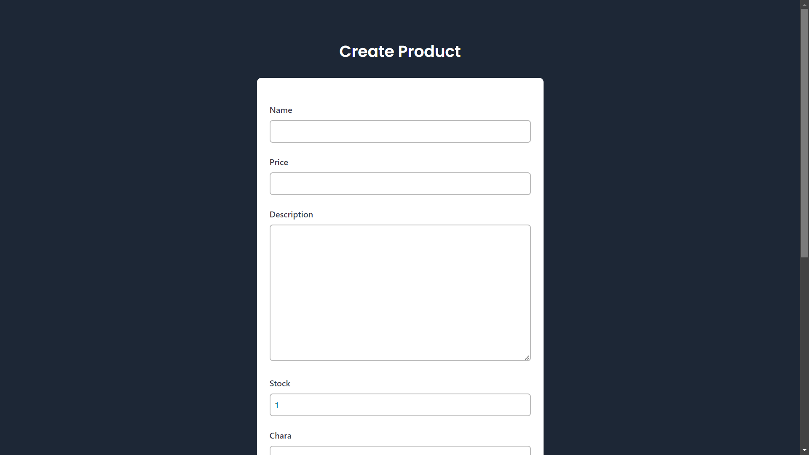
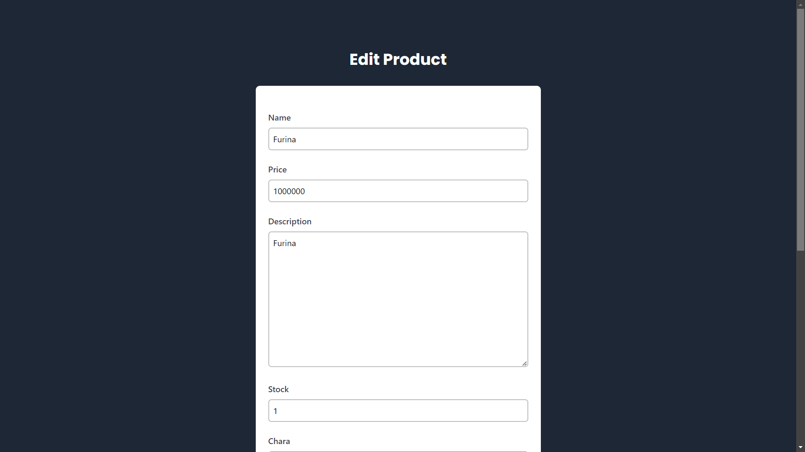
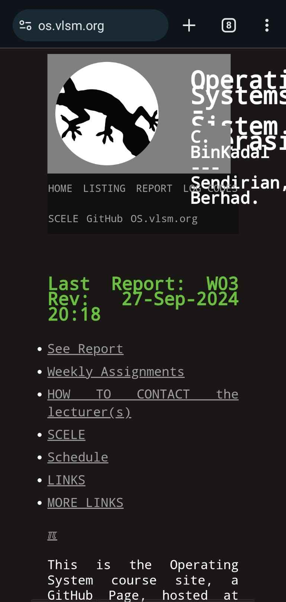
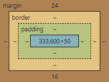

<a id="readme-top"></a>

# <p align="center"></p>

Celestia is a Hoyoverse Official Merchandise E-Commerce that offers some products officially made by Hoyoverse. This Project was made for one of the task in <a href="https://pbp-fasilkom-ui.github.io/ganjil-2025/"> Pemrograman Berbasis Platform (PBP) Gasal 2024/2025</a>.

<br>

> **Note:** <br> This is not an actual online shop for Hoyoverse Merchandise.

<br>

# ⚙️ Deployment and Usage
The deployed project is on PWS (Pacil Web Service), which can be accessed [here](http://daniel-liman-celestia.pbp.cs.ui.ac.id/).

If you want to try and run the project from your local device, open http://127.0.0.1:8000 or http://localhost:8000 with your browser to see the result.

<br>

# 📝 Assignment
**Nama**    : Daniel Liman<br>
**NPM**     : 2306220753<br>
**Kelas**   : PBP F

| Tugas Sebelumnya: | [Tugas 2](https://github.com/hyvos07/celestia/wiki/Tugas-2) | [Tugas 3](https://github.com/hyvos07/celestia/wiki/Tugas-3) | [Tugas 4](https://github.com/hyvos07/celestia/wiki/Tugas-4)
|-|-|-|-|

<br>

## Tugas 5
### Implementasi Desain Web menggunakan HTML, CSS dan Framework CSS

1. Implementasi Fitur Edit dan Hapus Produk
    *Views* dari mengedit dan menghapus produk berada pada `edit_product` dan `delete_product`.
    ```python
    # Edit a product entry
    def edit_product(request, id):
        product = Product.objects.get(pk = id) # get product by id

        form = ProductForm(request.POST or None, instance=product) # create form bdsrkan instance tsb

        if form.is_valid() and request.method == "POST":
            form.save() # save
            return HttpResponseRedirect(reverse('main:show_main')) # balik ke main page

        context = {'form': form}
        return render(request, "edit_product.html", context) # template html yang digunakan


    # Delete a product entry
    def delete_product(request, id):
        product = Product.objects.get(pk = id) # get product by id
        product.delete() # delete
        return HttpResponseRedirect(reverse('main:show_main'))
    ```

2. Kustomisasi desain pada *template* HTML yang telah dibuat pada tugas-tugas sebelumnya

    Beberapa desain dari tugas-tugas sebelumnya kebanyakan masih diimplementasikan pada tugas ini, tapi beberapa *page* yang masih memiliki desain *default* dari Django sudah diberi sedikit sentuhan CSS dan Tailwind.

    Beberapa elemen di `main` *page* juga dikonversi memakai Tailwind untuk mengganti *style* CSS yang dipakai dan memangkas sebagian besar konfigurasi *style* yang ada di `main.css`.

    Beberapa page yang memiliki perubahan desain adalah sebagai berikut.

    - [Login Page](https://github.com/hyvos07/celestia/blob/main/main/templates/login.html)
        
    

    - [Register Page](https://github.com/hyvos07/celestia/blob/main/main/templates/register.html)
        


    - [Main Page](https://github.com/hyvos07/celestia/blob/main/main/templates/main.html)
         

        
    - [Create Product Page](https://github.com/hyvos07/celestia/blob/main/main/templates/create_product.html)
        

    Selain itu, terdapat sebuah page tambahan baru untuk [edit produk](https://github.com/hyvos07/celestia/blob/main/main/templates/edit_product.html) di `edit_product.html` dan desain *[card](https://github.com/hyvos07/celestia/blob/main/main/templates/product_card.html)* yang digunakan untuk menampilkan produk pengguna.

    


### Urutan Prioritas Pengambilan CSS Selector

CSS memiliki prioritas pengambilan (atau *specificity*) sendiri dalam menentukan *style* mana yang akan dipakai jika terdapat beberapa CSS selector pada suatu elemen HTML. Urutan prioritasnya, mulai dari yang paling tertinggi adalah sebagai berikut:

| No. | CSS Selector | Keterangan | Contoh |
| --- | ------------ | ---------- | ------ |
| 1 | **Inline Style** | *Style* yang langsung dideklarasikan pada sebuah elemen HTML akan digunakan langsung oleh elemen tersebut | ```<p style="color: purple;">PBP asik</p>``` |
| 2 | **ID Selector** | *Selector* yang mengacu pada ID elemen HTML, didefinisikan dengan `#` | `#header { background-color: yellow; }` |
| 3 | **Class Selector** | *Selector* yang mengacu pada sebuah kelas (yang kita buat) di HTML, didefinisikan dengan `.` | `.box { color: red; }` |
| 4 | **Tag Selector** | *Selector* yang langsung mengacu pada tag HTML, seperti `h1`, `p`, atau `div` | `p { color: blue; }` |
| 5 | **Bawaan dari Browser** | *Style* default yang dimiliki oleh *browser* yang dipakai oleh kita | Teks di tag `<h1>` secara otomatis akan berukuran lebih besar daripada teks di tag `<p>` |

Selain *specificity* di atas, terdapat pula *selector* yang memakai *flag* `!important`, yang akan mendahului semua prioritas lainnya. Jika terdapat dua `!important` di elemen yang sama, maka yang lebih tinggi prioritasnya di *specificity* akan lebih didahulukan.

### Mengapa *responsive design* menjadi konsep yang penting dalam pengembangan aplikasi web?

*Design* aplikasi web yang *responsive* akan mengikuti batasan ukuran dan orientasi tampilan yang dimiliki oleh *device* yang digunakan oleh pengguna aplikasi web kita. *Design* yang *responsive* tentu saja akan meningkatkan pengalaman pengguna (*user experience*) dalam mengakses aplikasi web yang kita miliki. Contoh dari situs web yang *responsive* adalah seperti situs web GitHub ini sendiri, yang akan mengikuti lebar dari layar *browser* kita jika kita ubah ukurannya menjadi lebih besar maupun kecil.

Misalkan pada situs web Mata Kuliah OS, yaitu [os.vlsm.org](https://os.vlsm.org/), tampilan *mobile* yang dimiliki oleh situs web tersebut akan sulit untuk dipahami dan dapat membingungkan pengguna yang ingin mengakses fitur dari web tersebut. *Design* yang tidak *responsive* dari situs web os.vlsm.org ini dapat menjadi contoh langsung mengapa *responsive design* penting dimiliki oleh aplikasi web yang kita punya.


<br> <br>

Selain meningkatkan *user experience*, *responsive design* juga bisa meningkatkan kemungkinan pengguna internet untuk mengunjungi situs kita lewat mesin pencari seperti Google atau Bing. Hal ini bisa terjadi karena Google dan mesin pencari lainnya memprioritaskan situs web yang paling relevan dan *responsive* pada pelanggan dengan *device* yang berbeda. Hal ini juga menyebabkan meningkatnya SEO (*search engine optimization*) untuk situs tersebut, sehingga lebih banyak pengunjung yang mengunjungi aplikasi web kita.

### Perbedaan antara *Margin*, *Border*, dan *Padding*

- **Margin**

    Ruang yang ada di luar elemen HTML, mengatur jarak antara elemen tersebut dengan elemen lain di sekitarnya.
    ```css
    div {
        margin: 20px 10px 5px 2px;  /* format Top, Right, Bottom, Left */
        margin: 20px 10px 5px;      /* format Top, Left-Right, Bottom */
        margin: 20px 10px;          /* format Top-Bottom, Left-Right */
        margin: 20px;               /* format All Side */
        /* Margin juga bisa dipisah-pisah bedasarkan sisinya, seperti margin-top, margin-left, dan lainnya. */
    }
    ```

- **Border**

    Garis perbatasan yang mengelilingi elemen dari HTML. *Border* juga memisahkan *margin* dengan *padding* yang dimiliki oleh si elemen HTML. Berbeda dengan *margin* dan *padding*, *border* bisa memiliki warna nya sendiri.
    ```css
    div {
        border: 2px solid black;    /* width, style, color */
    }
    ```

- **Padding**

    Ruang di dalam elemen HTML, yang berada di antara *child*/konten dari elemen tersebut dengan border. *Padding* memberikan jarak di dalam elemen, sehingga *child* atau kontennya tidak menyentuh langsung border.
    ```css
    div {
        padding: 10px;
    }
    ```
    Mirip dengan *margin*, *padding* juga bisa dipisah bedasarkan sisi nya dan bisa berisi hingga 4 nilai.

#### Ilustrasi Penempatan *Margin*, *Border*, dan *Padding*


<br>
<br>

### Konsep *flex box* dan *grid layout* di CSS

- **Flexbox**
    
    *Flexbox* atau *Flexible Box* adalah sebuah *layout* yang dipakai untuk memastikan elemen tersebut responsif dan fleksibel pada suatu dimensi (horizontal maupun vertikal). Elemen HTML yang mengimplementasikan *layout* ini dapat memiliki ukuran yang fleksibel dan berubah-ubah sesuai ukuran dimensi yang dipilih.

    Contoh Penggunaan:
    ```css
    .container {
        display: flex;              /* By default, flex akan bekerja dalam dimensi horizontal */
        flex-direction: column;     /* column --> vertikal, row --> horizontal */
    }
    
    .item {
        flex-grow: 1;   /* Mengatur proporsi besaran flex yang class item ini miliki */
        padding: 10px;
    }
    ```

- **Grid**

    Jika *flexbox* hanya bisa mengatur satu dimensi saja, *grid* membuat sebuah *layout* dua dimensi yang kompleks dengan pengaturan yang lebih presisi (misalnya, halaman dengan *header*, *sidebar*, dan *footer*). *Grid* dapat membuat tata letak yang responsif dan fleksibel tanpa bergantung pada besaran posisi yang absolut.

    Contoh Penggunaan:
    ```css
    .container {
        display: grid;
        grid-gap: 10px; /* Jarak antar kolom */
        grid-template-columns: 1fr 2fr; /* item di kolom 1 akan lebih kecil dari yang ada di kolom 2 */
    }
    ```

Secara general, perbedaan antara *flexbox* dan *grid* adalah sebagai berikut.
| *Flexbox* | *Grid* |
| --------- | ------ |
| Mengatur tata letak salah satu dimensi (baris atau kolom) | Mengatur tata letak dua dimensi (baris dan kolom) |
| Cocok untuk tata letak linier	| Cocok untuk tata letak kompleks dan struktur grid |
| Mengontrol penyelarasan elemen di sepanjang satu sumbu | Membagi ruang dalam baris dan kolom dengan kontrol lebih presisi |
| Sangat fleksibel dalam perataan elemen | Memberikan kendali lebih besar atas penempatan elemen di grid |